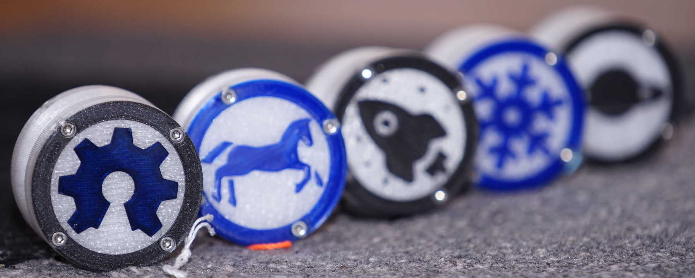

# Theme-Yoyo - a Customizable Yoyo

*Place your own graphic on top of the yoyo or customize it!!*

Yoyo is based of two parts. The YoyoBase which holds both halfs together via screw and bearing (R188KK - 8-Ball-Bearing). The ThemeBase can be customized with an vector graphic ('fileMotive' variable).
Just set the correct path to your SVG file with the 'fileMotive' variable and scale the graphic ('scaleSVG' variable) to fit the inner part of the upper yoyo plate. You can move the SVG graphic with xMoveSVG, yMoveSVG or set another extrusion width.

Additionally: the 'tools'-directory contains a bash script to convert a png to svg (with pre-conversion to pnm). This script needs __'potrace'__ which can be installed via package manager (on Linux).

SVG graphics with CC0 license can be obtained at:

  - https://publicdomainvectors.org/
  - https://freesvg.org/
  - https://www.svgrepo.com

### Printing
- print ThemeBase on flat surface (graphic up)
- do color change at the graphic to separate it from background
- enable ironing on top layers the get a nice finish
- print resolution 0.1mm
- use PETG for stronger parts
- ...

### Parts
- printed YoYo Parts (2x yoyoBase_xmm.stl, 2x YoyoThemeX.stl)
- one M3x20 screw with M3 nut for Axis
- 8 M3x6 screws (cylinder head screw)
- 2 O-Rings 15x2.5mm
- R188KK Bearing
- Cord (there are ready Yoyo Cords, relatively cheap)

### Assembling
- place the bearing onto the center of the yoyo base
- place the o-ring in both yoyo bases
- put both yoyo bases together (may be necessary to press them carefully together)
  - they should be holded together by the bearing
- screw both yoyo bases together with the M3x20 screw (do not overthight the axis)
- screw the theme parts on top of each base carefully (do not overthight them)
  - tip: measure the weigth of the theme parts and balance them out with small parts of filament
    which you can place into the furrow/gouge which are extra made for weigth balancing
- maybe the yoyo needs to be weared in some minutes

### Images

# LICENSE

 Dieses Werk ist lizenziert unter einer <a rel="license" href="http://creativecommons.org/licenses/by-sa/4.0/">Creative Commons Namensnennung - Weitergabe unter gleichen Bedingungen 4.0 International Lizenz</a>.

 This work is licensed under a <a rel="license" href="http://creativecommons.org/licenses/by-sa/4.0/">Creative Commons Attribution-ShareAlike 4.0 International License</a>.
